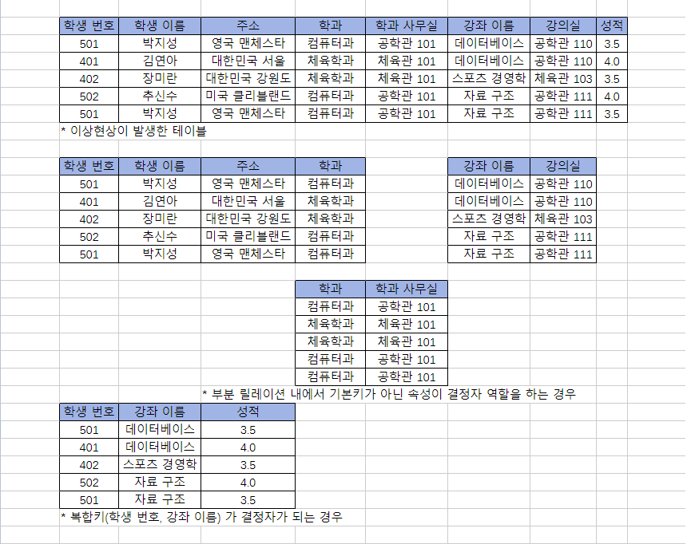
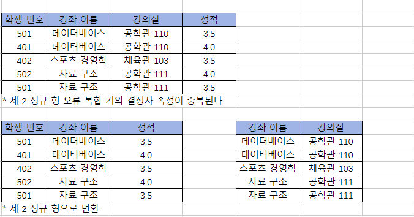
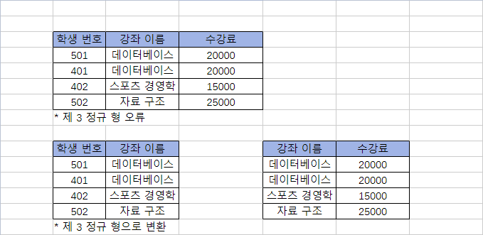
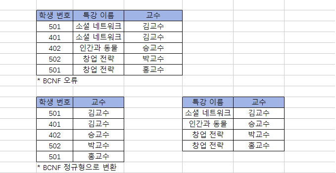
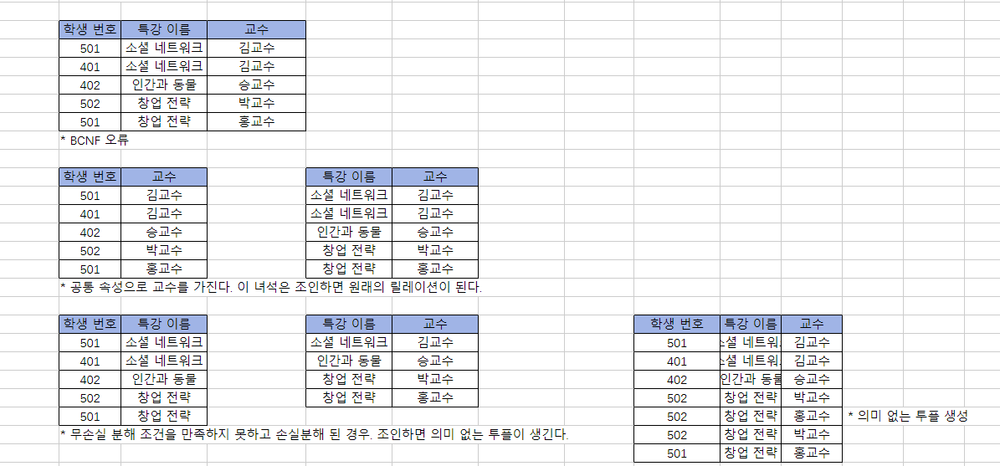

# 정규화

잘못 설계된 테이블로 삽입, 삭제, 수정 작업을 하면 조회시 이상현상이 발생한다. 이상현상은 데이터의 일관성을 훼손하고 데이터의 무결성을 깨뜨리는데 이를 정상으로 만드는 과정을 정규화라고 한다. 

# 01 이상현상

### 이상현상의 개념
```
* 삭제 이상

투플 삭제 시 같이 저장된 다른 정보까지 연쇄적으로 삭제되는 현상이다.
```
```
* 삽입 이상 (해당 하는 값이 없어 NULL 을 입력해야 하는 현상) 

투플 삽입 시 값이 없어서 NULL 값을 입력하면 원치 않는 결과를 조회할 수 있다. NULL 값은 데이터가 없다는 것을 의미한다.

카운트 조회시 NULL 값은 집계되지 않으며, 사칙 연산을 수행할 때 NULL 값과 숫자를 더하게 되면 0이 아닌 NULL + 숫자가 되기 때문에
연산의 결과 NULL 값을 반환하게 된다.

따라서 가능한 테이블에 NULL 값은 없어야 한다.
```
```
* 수정 이상

update 문은 조건에 맞는 값을 일괄 수정하지만, 조건을 잘못 주면 데이터의 불일치 문제가 발생한다. 
투플 수정 시 중복된 데이터의 일부만 수정되어 데이터의 불일치 문제가 일어나는 현상이다.
```
### 이상현상의 예시 
```
* 이상 현상 실습을 위한 summer 계절 학기 테이블 

create table summer
(sid integer,
class varchar(20),
price integer);

insert into summer values(100, 'FORTRAN', 20000);
insert into summer values(150, 'PASCAL', 15000);
insert into summer values(200, 'C', 10000);
insert into summer values(250, 'FORTRAN', 20000);
```
```
앞서 설명했듯이 조회를 할 때는 이상현상이 발생하지 않는다. 간단한 SQL 구문을 연습하고 간다. 

select sid,class from summer;
select price 'C 수강료' from summer where class like 'c';
select distinct class from summer where price = (select max(price) from summer); // 부속 질의
select count(*), sum(price) from summer;
```
```
Tip - MySQL 이 제공하는 SAFE UPDATES 모드란?

UPDATE 나 DELETE 중 Error Code: 1175 가 발생할 수 있는데 이 옵션은 UPDATE, DELETE 수행 시 실수를 방지하기 위해
기본키 속성을 사용해서만 가능하도록 한 안전 옵션 때문이다.

SET SQL_SAFE_UPDATES=0; // 옵션 off
SET SQL_SAFE_UPDATES=1; // 옵션 on

간단하게 옵션을 껏다 켤 수 있고 workbench 속성에서 따로 설정할 수 도 있다. 
```

#### 삭제 이상
```
지금 테이블 구조에서 200 번 학생의 게절학기 수강 신청을 취소하면 C 강좌의 수강료를 조회할 수 없게 된다.

delete from summer whre sid=200; // 삭제 후 조회하면 C 강좌도 같이 삭제된 것을 알 수 있다! 
```
#### 삽입 이상 
```
새로운 자바 강좌가 생성되었는데 아직까지 신청한 학생이 없어서 NULL 값을 sid 에 입력하는 경우 집계 함수 사용시 원하지 않는 결과를
조회할 수 있다. (전체 조회시 5 개 투플이 조회되지만, 개별 속성(sid) 조회시 4 개만 조회된다.)

insert into summer values(null, 'java', 25000); // 자바 생성

select count(*) '수강 인원' from summer; // 전체 투플 조회는 5 개로 나오지만
select count(sid) '수강 인원' from summer; // sid 속성 개별 조회시 4 개만 조회된다.
select count(sid) '수강 인원' from summer where sid is not null; // 4 개

delete from summer where sid is null; // 실습을 위해 투플 삭제 
```
#### 수정 이상
```
update summer set price=20000 where class like 'fortran'; // fortrn 강좌를 일괄적으로 20000 원으로 수정한다.

update summer set price=15000 where class like 'fortran' and sid=100; // 특정 투플만 강좌 가격을 수정하면 전체 수정되지 않는다.
select price 'fortran 수강료' from summer where class like 'fortran'; // 수강료 조회시 두 건의 수강료가 나옴(데이터 불일치 문제)

update summer set price=20000 where class like 'fortran'; // 실습을 위해 일괄 수정 
```
### 이상현상 수정하기

앞서 구현한 테이블을 이용해서 이상현상의 예시들을 알아보았다. 테이블 구조를 수정해서 이상현상이 발생하지 않도록 만들어 본다.

```
summer 테이블을 summerprice(수강료 정보), summerenroll(수강 신청 정보) 테이블로 분리한다. 

/* 기존 테이블 삭제 */
drop table if exists summerprice;
drop table if exists summerenroll;

/* summerprice 테이블 생성 */
create table summerprice
(class varchar(20),
price integer);

insert into summerprice values('fortran', 20000);
insert into summerprice values('pascal', 15000);
insert into summerprice values('c', 10000);

select * from summerprice;

/* summerenroll 테이블 생성 */
create table summerenroll
(sid integer,
class varchar(20));

insert into summerenroll values (100, 'fortran');
insert into summerenroll values (150, 'pascal');
insert into summerenroll values (200, 'c');
insert into summerenroll values (250, 'fortran');

select * from summer enroll;
```
```
간단한 조회 쿼리

select class from summerprice where price=(select max(price) from summerprice);
// 수강료가 가장 비싼 과목을 구한다.

select count(*), sum(price) from summerprice sp, summerenroll se where sp.class = se.class;
// 총 학생 수 및 수강료 총 금액을 구한다.
```

#### 삭제 이상 없음
```
delete from summerenroll where sid=200;
select price 'c 수강료' from summerprice where class like 'c';

수강 등록 정보와, 수강료 정보를 분리했기 때문에 단순히 수강등록 정보를 삭제하더라도 수강료 정보는 삭제되지 않는다. 
```
#### 삽입 이상 없음
```
insert into summerprice values ('java',25000);

수강 신청과 수강료 정보를 분리했기 때문에 null 값을 넣지 않아도 된다.
```
#### 수정 이상 없음
```
update summerprice set price=15000 where class like 'fortran';
select price 'fortran 수강료' from summerprice where class like 'fortran';

fortran 과목의 수강료는 수강료 정보에 하나만 저장되어 있기 떄문에 수정 후 데이터 불일치를 우려할 필요가 없다. 
```

# 02 함수 종속성 

이상현상이 발생하는 테이블을 정상으로 되돌리는 것을 정규화라고 하며 정규화를 하기 위해서는 테이블을 분석하고 기본키와 함수 종속성을 파악해야 한다. 

#### + 함수 종속성이란?
```
데이터베이스에서는 왼쪽 속성의 모든 값에 대하여 오른쪽 속성의 값이 유일하게 결정될 때 함수적으로 종속한다라고 한다.
(어떤 속성 A 를 알면 다른 속성 B 의 값이 유일하게 정해지는 의존 관계)

예를 들면 릴레이션 R 과 R 에 속하는 속성의 집합 X,Y 가 있을 때 X 각각의 값이 Y 의 한 개 와 대응 될 때 X 는 Y 를 함수적으로 결정한다라고
하고 X -> Y 로 표기한다. 이때 X 를 결정자라고 하고, Y 를 종속 속성이라고 한다.

함수 종속성은 보통 릴레이션 설계 때 속성의 의미로부터 정해진다.

함수 종속성을 판단할 때는 릴레이션의 현재 인스턴스(데이터) 만을 갖고 판단하는 것이 아니라 속성이 갖는 의미를 가지고 판단해야 한다.
단순히 데이터 값 X 가 Y 를 유일하게 식별할 수 있다고 해서 종속성을 가지지 않는다. 
```
```
* 함수 종속성 예시

학생 번호 -> 학생 이름
학생 번호 -> 학과
학생 번호 -> 주소

학과 -> 학과 사무실
강좌이름 -> 강의실

(학생번호, 강좌이름) -> 성적 // 결정자가 복합 속성일 수도 있다.
```

### 함수 종속성 규칙과 예시 

함수 종속성을 구하면 여러가지 규칙을 적용해서 종속성을 유도할 수 있다. 403 p 

```
부분집합 규칙 : if Y ⊆ X , then X -> Y 
증가 규칙 : if X -> Y, then XZ -> YZ 
이행 규칙 : if X -> Y, and Y-> Z,  then X -> Z 

결합 규칙 : if X -> Y and X -> Z, then X -> YZ
분해 규칙 : if X -> YZ, then  X -> Y and X -> Z
유사이행 규칙 : if X -> Y and WY -> Z then WX -> Z

구체적 예시는 교재 403 참고 
```
### 함수 종속성과 기본키
```
기본 키는 릴레이션의 모든 속성에 대해 결정자의 역할을 하기 때문에 릴레이션의 함수 종속성을 파악하기 위해서는 우선
기본키를 찾아야 한다.

K -> KABC
```
### 이상 현상과 결정자
```
이상 현상은 한 개의 릴레이션에 두 개 이상의 릴레이션 정보가 포함되어 있을 때 나타난다. 이상현상을 해결하려면 합쳐진 테이블을 정규화 하면 된다.

정규화를 하려면 우선 이상 현상이 발생한 릴레이션 내에서 기본키를 찾는다. 앞서 설명했듯이 기본키는 릴레이션의 모든 속성에 대한 결정자
역할을 한다. (이상 현상이 발생한 릴레이션에서는 복합키가 기본키를 구성하고 있을 수 있다.)  

이상현상은 기본키가 아니면서 합성 릴레이션의 복합키 내에 결정자인 속성(비후보키 결정자 속성) 이 있을 때 발생한다.
(이때 주의할 점은 복합키가 기본키 결정자가 되어 종속 속성을 가지고 있을 수도 있기 때문에 이 점을 고려해서 종속 속성을 찾아야 한다.)

복합 키 내의 후보키 및 비후보키 결정자 속성으로 각각의 종속 속성을 하나씩 찾아 나가면 결정자를 기준으로 테이블을 분리할 수 있고 각 테이블의
결정자가 부분 릴레이션의 기본 키가 된다.

부분 릴레이션 내에서 기본키가 아닌 속성이 결정자 역할을 할 수도 있으므로 부분 릴레이션 내에서도 정규화를 진행한다.
```
#### + 이상현상 테이블을 정규화 한 예시 

  

```
* 함수 종속성 
학생 번호 -> 학생 이름
학생 번호 -> 학과
학생 번호 -> 주소

강좌이름 -> 강의실
학과 -> 학과 사무실

(학생번호, 강좌이름) -> 성적 // 결정자가 복합 속성일 수도 있다.
```
# 03 정규화

이상 현상의 원인은 여러 가지가 있지만 대부분 두 가지 이상의 정보가 한 릴레이션에 저장되어 있기 때문에 발생한다.

이상현상이 발생하면 기본키와 함수 종속성을 이용해서 이상현상이 없어질 때까지 분해한다. 이것을 정규화 라고 한다.

## 정규화 과정

함수 종속성의 유형에 따라 정규형 등급을 나눌 수 있다. 정규형이 높을 수록 이상현상은 줄어든다.

### 제 1 정규형
```
A relation in which the intersection of each row(tuple) and column contains one and only one value.
제 1 정규형은 릴레이션의 속성 값이 원자값이어야 한다는 조건이다.
```


### 제 2 정규형
```
A relation that is in first normal form(제 1 정규형) and every non-primary key attribute is fully functionally depedent on the primary key.
릴레이션 R 이 제 1 정규형이고 기본키가 아닌 속성이 기본키에 완전 함수 종속일 때 제 2 정규형이라고 한다.
```
#### + 완전 함수 종속이란? 
```
A(후보키 또는 복합키가 되는 속성) -> B 의 함수 종속성이 성립할 때 B 가 A 의 속성 전체에 함수 종속하고 B 가 부분 집합 속성 A (a1, a2)에
함수 종속하지 않을 경우 완전 함수 종속이라고 한다.

반면, A(후보키 또는 복합키가 되는 속성) -> B 종속성에서 A 의 속성 일부를 제거해도 종속성이 여전히 성립한다면 불완전 함수 종속이라고 한다.
```

```
제 2 정규 형으로 변환하기 전에는 기본키로 (학생번호, 강좌이름) 을 사용하는데 강좌이름만으로도 강의실 속성을 종속할 수 있기 때문에
불완전 함수 종속이다. 강좌 이름, 강의실 속성을 릴레이션에서 분리하면 제 2 정규형으로 만들 수 있다. 
```
### 제 3 정규형
```
A relation(테이블, 릴레이션) that is in first and second normal form (제 2 정규형) and in which no non-primary key is transitively dependent on
the primary key

제 2 정규형이면서 기본키가 아닌 속성이 기본키에 비 이행적으로(분리되어서) 종속될 때 이를 제 3 정규형이라고 한다.
A(후보키 또는 복합키가 되는 속성) -> B , B -> C 가 성립할 때 A -> C 가 성립되는 함수 종속성을 말한다.

이때 A B C 속성이 합쳐진 릴레이션은 제 3 정규형 오류이며 A -> B / B -> C 로 릴레이션을 분리하고 논리적(비이행적) 으로 A -> C 가 성립되도록 구현해야 한다.
(기본키가 아닌 강좌 이름에 일반 속성이 한번 더 종속될 수 있기 때문이다.)
```


### BCNF
```
A relation is in BCNF if and only if every determinant is a candiate key.
릴레이션에 존재하는 함수 종속성에서 모든 결정자가 후보키인 릴레이션은 BCNF 정규형이다. 
```
```
(학생번호, 특강이름) 은 오류 릴레이션의 기본키(후보키) 이며 결정자이다. 이 오류 릴레이션에서는 결정자이면서 후보키가 아닌
교수(교수를 알면 특강 이름을 알 수 있다) 속성이 존재하기 때문에 이상현상이 발생하고 있다. 

그렇기 때문에 결정자를 후보키로 만드는 BCNF 정규형으로 변환해야 한다.
```


## 무손실 분해

정규화를 통해 릴레이션을 분리할 때는 지켜야할 규칙이 있다. 분해된 릴레이션간의 관계(relationship) 를 유지하기 위해 분해된 릴레이션은 공통 속성을 한 개 이상 두어야 한다.

공통 속성은 분해된 릴레이션을 하나로 조인할 때 사용된다.

```
릴레이션 R 을 분리해서 R1, R2 로 만들고 다시 조인했을 때 기존의 릴레이션을 만들 수 있어야 한다. 무손실 분해의 조건은
분해할 때 공통된 속성이 릴레이션 R1 의 키이거나 R2 의 키여야 한다는 것이다.
```

